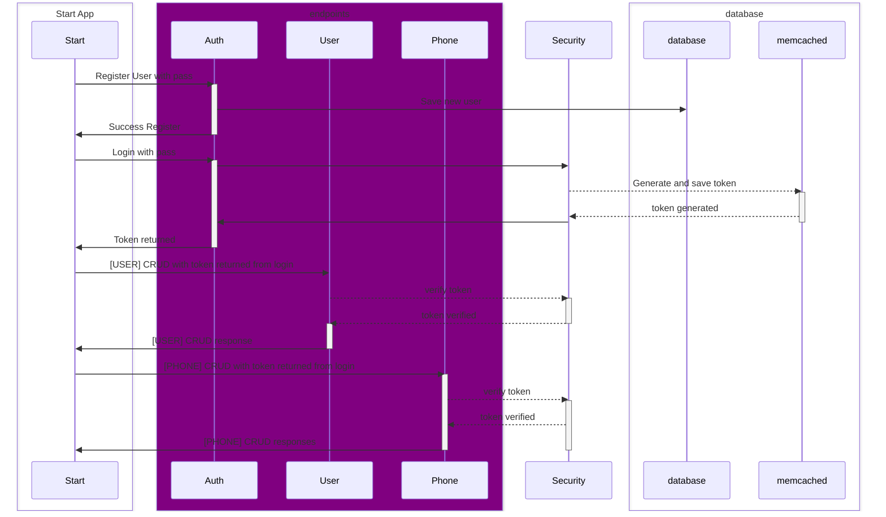

Project Documentation: User Management API  
JAVA Evaluation - Spring Boot

📌 Previous requirements
- Java 17+ (JDK)
- Maven 3.8+
- PostgreSQL (or H2 for development)
- Memcached
- IDE (IntelliJ, VS Code, Eclipse)

### Environment variables for development in your IDE

#### Use this to run the application

```shell
DB_FORMAT_SQL=true;DB_SHOW_SQL=true;DB_DDL_AUTO=create;DB_CREATE_NAMESPACES=true;JWT_SECRET=abcdefghijklmnopqrstvuwxyzabcdefghijklmnopqrstvuwxyzabcdefghijklmnopqrstvuwxyz;DB_INIT_MODE=always;H2_CONSOLE_ENABLED=true
```

#### Use this with docker-compose

```shell
DB_FORMAT_SQL=false;DB_SHOW_SQL=false;DB_INIT_MODE=never;JWT_SECRET=abcdefghijklmnopqrstvuwxyzabcdefghijklmnopqrstvuwxyzabcdefghijklmnopqrstvuwxyz;DB_PLATFORM=postgres;DB_URL=jdbc:postgresql://localhost:5432/userdb;DB_DRIVER_CLASS_NAME=org.postgresql.Driver;DB_USERNAME=postgres;DB_PASSWORD=postgres;DB_DIALECT=org.hibernate.dialect.PostgreSQLDialect;MEMCACHED_HOST=localhost;MEMCACHED_PORT:11211;APP_PROFILE=prod
```

---

### 🐳 Use Docker

If you prefer to use Docker, you can run Memcached with the following command:

```shell
docker run -d --name memcached -p 11211:11211 memcached
```

make image for java-users

```shell
docker image build --no-cache -t juser:latest .
```

or you can use the docker-compose file to build the image and run the application.

### Run the application with Docker compose

```shell
docker-compose up -d
```
---

## Install Java
To install Java on Linux, use sdkman. For example, on Ubuntu or Debian:

```shell
sudo apt update
sudo apt install curl -y
curl -s "https://get.sdkman.io" | bash
source "$HOME/.sdkman/bin/sdkman-init.sh"
sdk list java
sdk install java 17.0.8-tem
```

---

### Install PostgreSQL
To install PostgreSQL on Linux, use your package manager. For example, on Ubuntu or Debian:

```shell
sudo apt update
sudo apt install postgresql postgresql-contrib -y
```

On CentOS, Fedora, or RHEL:

```shell
sudo dnf install postgresql-server postgresql-contrib
```

After installation, you can start and enable the PostgreSQL service:

```shell
sudo systemctl start postgresql
sudo systemctl enable postgresql
```
Check the status of PostgreSQL:

```shell
sudo systemctl status postgresql
```

### Create PostgreSQL Database

```shell
sudo -u postgres psql
```

Then, in the PostgreSQL shell, create a new database and user:

```sql
-- Crear esquema si se usa uno (opcional en H2)
CREATE SCHEMA IF NOT EXISTS ac;

-- Secuencias
CREATE SEQUENCE IF NOT EXISTS ac.AC_AUTHORITY_SEQ INCREMENT 1 MINVALUE 1 NO MAXVALUE START WITH 1000;
CREATE SEQUENCE IF NOT EXISTS ac.AC_PHONE_SEQ INCREMENT 1 MINVALUE 1 NO MAXVALUE START WITH 1000;

-- Tabla users
CREATE TABLE IF NOT EXISTS ac.users (
    id BIGINT PRIMARY KEY DEFAULT nextval('ac.AC_AUTHORITY_SEQ'),
    uuid UUID NOT NULL, name VARCHAR(255) NOT NULL,
    email VARCHAR(255) NOT NULL UNIQUE,
    password VARCHAR(255) NOT NULL,
    last_login TIMESTAMP,
    is_active BOOLEAN,
    created_date TIMESTAMP,
    created_by VARCHAR(255),
    last_modified_date TIMESTAMP,
    last_modified_by VARCHAR(255)
    )
;

-- Comments
COMMENT ON TABLE ac.users IS 'Tabla de usuarios';
COMMENT ON COLUMN ac.users.uuid IS 'UUID del usuario';
COMMENT ON COLUMN ac.users.name IS 'Nombre del usuario';
COMMENT ON COLUMN ac.users.email IS 'Email del usuario';
COMMENT ON COLUMN ac.users.password IS 'Contraseña del usuario';
COMMENT ON COLUMN ac.users.last_login IS 'Último inicio de sesión del usuario';
COMMENT ON COLUMN ac.users.is_active IS 'Estado de actividad del usuario';
COMMENT ON COLUMN ac.users.created_date IS 'Fecha de creación del usuario';
COMMENT ON COLUMN ac.users.created_by IS 'Usuario que creó el registro';
COMMENT ON COLUMN ac.users.last_modified_date IS 'Fecha de última modificación del usuario';
COMMENT ON COLUMN ac.users.last_modified_by IS 'Usuario que realizó la última modificación';

-- Tabla phones
CREATE TABLE IF NOT EXISTS ac.phones (
    id BIGINT PRIMARY KEY DEFAULT nextval('ac.AC_PHONE_SEQ'),
    phone_number VARCHAR(20) NOT NULL,
    city_code VARCHAR(10) NOT NULL,
    country_code VARCHAR(10) NOT NULL,
    user_id BIGINT NOT NULL,
    created_date TIMESTAMP,
    created_by VARCHAR(255),
    last_modified_date TIMESTAMP,
    last_modified_by VARCHAR(255),
    CONSTRAINT idx_user_id FOREIGN KEY (user_id) REFERENCES users(id) ON DELETE CASCADE
    )
;

CREATE INDEX IF NOT EXISTS idx_user_id_phone_number ON ac.phones (user_id, phone_number);

-- Comments
COMMENT ON TABLE ac.phones IS 'Tabla de teléfonos';
COMMENT ON COLUMN ac.phones.phone_number IS 'Número de teléfono';
COMMENT ON COLUMN ac.phones.city_code IS 'Código de ciudad del teléfono';
COMMENT ON COLUMN ac.phones.country_code IS 'Código de país del teléfono';
COMMENT ON COLUMN ac.phones.user_id IS 'ID del usuario asociado al teléfono';

```

---
## Install Memcached
To install Memcached on Linux, use your package manager. For example, on Ubuntu or Debian:

```shell
sudo apt update
sudo apt install memcached -y
```

On CentOS, Fedora, or RHEL:
```shell
sudo dnf install memcached
```

After installation, you can start and enable the service:
```shell
sudo systemctl start memcached
sudo systemctl enable memcached
```

Check the status of Memcached:
```shell
sudo systemctl status memcached
```

---

🛠️ Command to run the application

```shell
export DB_INIT_MODE=always; export JWT_SECRET=abcdefghijklmnopqrstvuwxyzabcdefghijklmnopqrstvuwxyzabcdefghijklmnopqrstvuwxyz && mvn spring-boot:run -Dspring-boot.run.profiles=dev -Ddebug
```
---

#### 🌐 Endpoints de la API

🔐 Authentication

- POST /auth/login - Login
  ```json
  {
      "username": "string",
      "password": "string"
  }
  ```
- POST /auth/register - Register
  ```json
    {
    "name": "string",
    "username": "string",
    "password": "string"
    }
  ```
- POST /auth/refresh-token - Refresh token | Only need Authorization header with the old token
- GET /auth/logout - Logout | Only need Authorization header with the old token

🧔 Users

- GET /users/all - Get all users | Only need Authorization header
- GET /users/{id} - Get user by ID | Only need Authorization header
- POST /user - Create user | Only need Authorization header
    ```json
    {
      "name": "string",
      "email": "string",
      "password": "string",
      "phones": [
        {
          "number": "string",
          "cityCode": "string",
          "countryCode": "string"
        }
      ]
    }
    ```
- PATCH /users/{id} - Update user by ID | Only need Authorization header
  ```json
    {
     "name": "string",
     "active": "boolean"
    }
    ```
- DELETE /users/{id} - Delete user by ID | Only need Authorization header

☎ Phones
- GET /phone/all - Get all phones | Only need Authorization header
- POST /phone/{id} - Add new phone to user | Only need Authorization header
    ```json
        {
        "number": "string",
        "cityCode": "string",
        "countryCode": "string"
        }
        ```
- DELETE /phone/{id} - Delete phone by ID | Only need Authorization header
  ```json
  {
    "number": "string"
  }
  ```
- PATCH /phone/{id} - Update phones by ID | Only need Authorization header
  ```json
  {
    "phones": [
        {
            "number": "string",
            "cityCode": "string",
            "countryCode": "string"
        },
        {
            "number": "string",
            "cityCode": "string",
            "countryCode": "string"
        }
    ]
  }
  ```

📊 API Documentation with Swagger  
Access the interactive interface:

🔗 http://localhost:8080/swagger-ui.html

---

#### 📦 Project Structure

```
java-users/
├── src/
│   ├── main/
│   │   ├── java/
│   │   │   └── com/glign/backend/
│   │   │       ├── component/    # Spring components
│   │   │       ├── config/       # Configurations (Security, Swagger)
│   │   │       ├── controller/   # REST Controllers
│   │   │       ├── dto/          # Data Transfer Objects
│   │   │       ├── exception/    # Exceptions
│   │   │       ├── jpa/          
│   │   │       │   └── entity/   # JPA Entities
│   │   │       ├── mapper/       # Mappers
│   │   │       ├── repository/   # Spring Data JPA Repositories
│   │   │       ├── security/     # JWT Security
│   │   │       └── service/      # Business logic
│   │   │       │   └── impl/     # Implementations of services
│   │   │       └── utils/        # Utilities
│   │   └── resources/
│   │       ├── application.yml  # Main configuration
├── pom.xml                      # Maven configuration
└── README.md                    # This file
```

